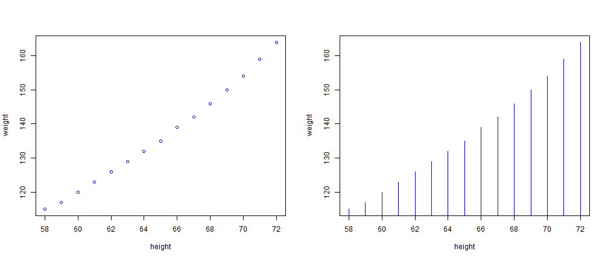

---
title       : What's your weight?
subtitle    : My ShinyApp
author      : Pascal Noel
job         : Free Lancer
framework   : io2012     # {io2012, html5slides, shower, dzslides, ...}
highlighter : highlight.js  # {highlight.js, prettify, highlight}
hitheme     : tomorrow      # 
widgets     : [bootstrap, quiz, shiny, interactive] # {mathjax, quiz, bootstrap}
ext_widgets: {rCharts: [libraries/nvd3]}
mode        : selfcontained # {standalone, draft}
knit        : slidify::knit2slides

--- .class #id 

## What is about?

1. An app for predicting weight based on height.  
2. Several exporatries data are done like scatterplot and histogram.
3. Shiny is used in order to built this app. 
4. Several kinds of widget allow the reactivity of the app. 
5. The women dataset provided by R is used for this propose. This dataset comprises 2 variables (Height in inch and Weight in pound) and 15 observations. 

--- .class #id 

## Exploratory data  

We observe a fairly well correlation between weight and height.

 


--- .class #id 

## Regression analysis

The regression analysis confirms the relationship shown previously. In increase of 1 inch in height causes an increase of 3.4 weight. 


```r
data(women)
weight_Women<-lm(weight~height,data=women)
weight_Women$coeff
```

```
## (Intercept)      height 
##      -87.52        3.45
```

--- .class #id 

## Predict your weight

Based on this regression relationship between weight and height, we built the algorithm for predicting weight. For intance, in the example below, wheight is a list of height. We can predict the weight (in pounds) for each height (in inch) giving.  


```r
data(women)
wheight<-c(34,45,78,50,27)
new.height<-data.frame(height=wheight)
weightPredict<-predict(weight_Women,newdata=new.height)
weightPredict
```

```
##       1       2       3       4       5 
##  29.783  67.733 181.583  84.983   5.633
```


